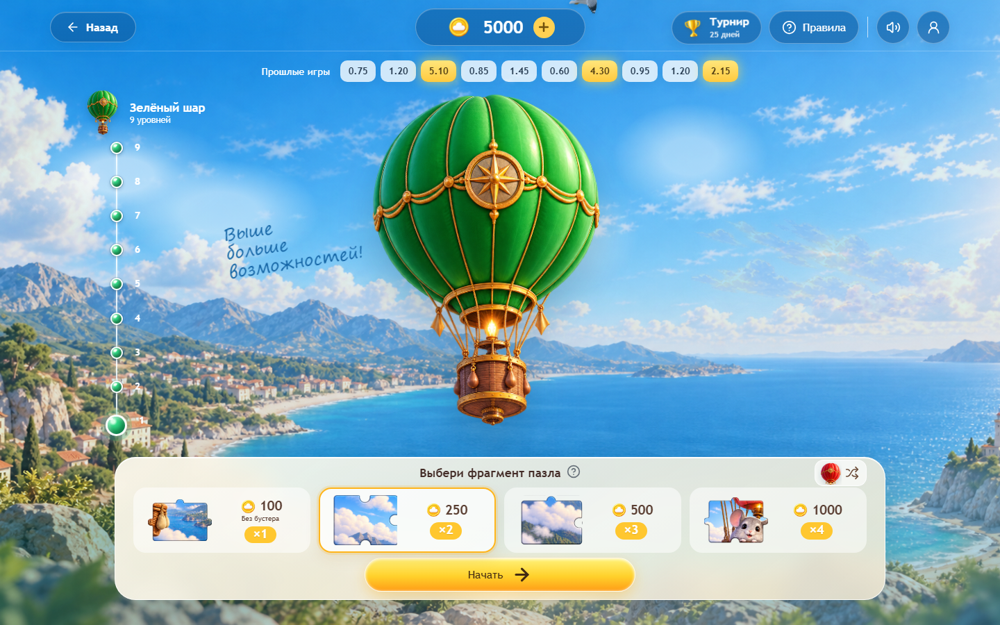
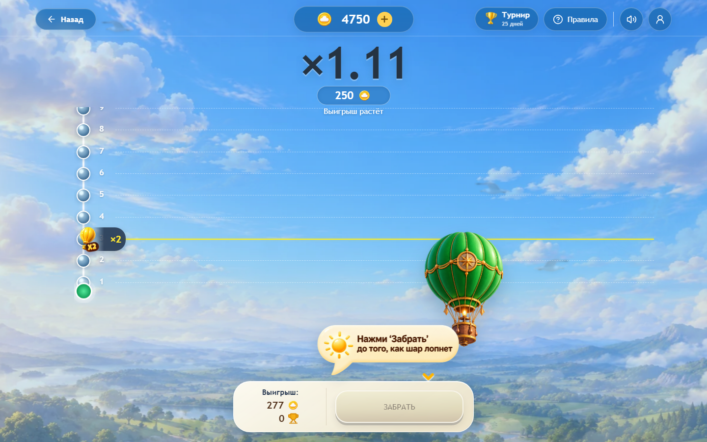
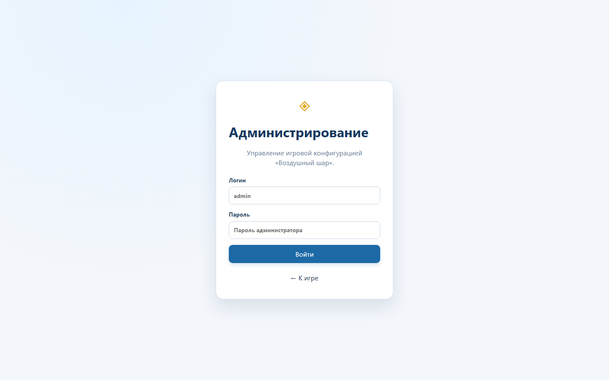
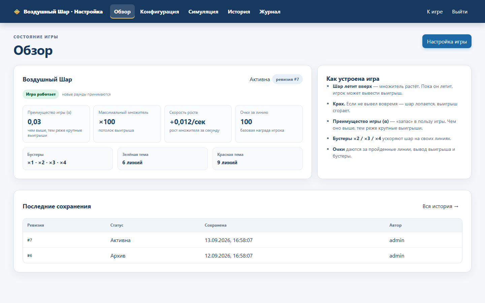

# Воздушный Шар

«Воздушный Шар» — бонусная crash-игра. Игрок выбирает воздушный шар, размер ставки и бустер, запускает полёт и забирает выигрыш до того, как шар лопнет.

Результат раунда определяет сервер. Клиент показывает ход полёта, принимает действия игрока и восстанавливает актуальное состояние после перезагрузки или кратковременного разрыва соединения. Бонусы и игровые очки ведутся раздельно.

## Содержание

- [Возможности](#features)
- [Интерфейс](#interface)
- [Стек](#stack)
- [Структура проекта](#structure)
- [Как проходит раунд](#round-flow)
- [Формула crash](#crash-formula)
- [Проверка честности](#fairness)
- [Админ-панель](#admin)
- [Удалённый сайт для теста](#remote-test)
- [Локальный запуск](#local-run)
- [Тестовые пользователи](#demo-users)
- [Основные API](#api)
- [Проверки](#checks)
- [Важные ограничения](#limitations)

<a id="features"></a>
## Возможности

- два режима полёта: зелёный на 9 уровней и красный на 12 уровней;
- четыре варианта ставки с бустерами от ×1 до ×4;
- серверный cashout, начисление очков и фиксация результата;
- восстановление активного раунда через snapshot и WebSocket replay;
- профиль игрока, косметические предметы и коллекции пазлов;
- рейтинг, турнир, история полётов и сценарий покупки билетов;
- commit/reveal данные для проверки завершённого раунда;
- отдельная админ-панель с версионированием настроек и журналом действий.

<a id="interface"></a>
## Интерфейс

### Стартовый экран


### Вход


### Выбор режима


### Ставка и бустер



### Полёт



<a id="stack"></a>
## Стек

- Frontend: React 19, TypeScript, Vite;
- Backend: Java 21, Spring Boot 3.5, Spring JDBC;
- база данных: PostgreSQL 17 и Flyway;
- realtime: WebSocket с checkpoint/replay восстановлением;
- инфраструктура: Docker Compose и Nginx;
- тесты: Vitest, Playwright, JUnit и Testcontainers.

<a id="structure"></a>
## Структура проекта

| Каталог | Назначение |
| --- | --- |
| `frontend/` | Пользовательский интерфейс, профиль, игровая сцена и админ-панель |
| `backend/` | Игровой движок, экономика, REST, WebSocket, fairness и работа с PostgreSQL |
| `e2e/` | Сквозные acceptance-тесты |
| `docs/` | Контракты, описание механик и технические отчёты |
| `infra/` | Конфигурация Nginx и инфраструктуры |
| `scripts/` | Локальные проверки и вспомогательные команды |

Основные переходы между экранами находятся в `frontend/src/App.tsx`. Игровая логика frontend собрана в `frontend/src/features/game`, работа со ставками — в `frontend/src/features/betting`, профиль и косметика — в `frontend/src/features/avatar` и `frontend/src/features/profile`.

Backend игрового движка находится в `backend/src/main/java/ru/airballoon/game`. Пользователи, экономика, профиль, история, рейтинг, турниры и админ API расположены в `backend/src/main/java/ru/hackathon/airballoon`.

<a id="round-flow"></a>
## Как проходит раунд

1. Игрок авторизуется и выбирает зелёный или красный шар.
2. На экране ставки выбирает стоимость полёта и бустер.
3. Frontend отправляет запрос на создание раунда. Backend списывает ставку и сохраняет конфигурацию раунда.
4. Сервер рассчитывает crash, публикует commitment и запускает события полёта.
5. Frontend получает состояние и обновления по WebSocket.
6. После достижения первого уровня игрок может забрать текущую выплату.
7. При cashout сервер фиксирует множитель и начисляет бонусы. Если crash произошёл раньше, ставка считается проигранной.
8. После завершения сервер раскрывает fairness-данные, которые можно повторно проверить.

Backend остаётся единственным источником истины для ставки, множителя, cashout, награды и баланса. Значения на клиенте используются только для отображения.

<a id="crash-formula"></a>
## Формула crash

В текущей ветке новые раунды используют серверную модель `HOUSE_EDGE_V1`. Сначала из детерминированного потока получается равномерное значение `U` в диапазоне `[0, 1)`. Затем применяется формула:

```text
если U < alpha:
    X = minCrashMultiplier
иначе:
    X = (1 - alpha) / (1 - U)

X_final = floor4(min(X, maxCrashMultiplier))
```

`alpha` задаёт преимущество системы. `minCrashMultiplier` и `maxCrashMultiplier` ограничивают результат. `floor4` означает округление вниз до четырёх знаков после запятой. Округлённое значение сохраняется в раунде и входит в commitment/reveal. Для фиксированного диапазона, где `minCrashMultiplier` равен `maxCrashMultiplier`, сервер возвращает это значение без случайного распределения.

При `minCrashMultiplier = 1` и допустимом целевом множителе `x` вероятность дойти до него до верхнего ограничения равна:

```text
P(X >= x) = (1 - alpha) / x
```

Для ставки `B` математическое ожидание выплаты на фиксированном target равно `B × (1 - alpha)`.

Приложенный к проекту справочник описывает следующую версию модели `HOUSE_EDGE_V2` на основе inverse CDF усечённого распределения Парето:

```text
p = 1 / (1 - alpha)
X = [U × max^(-p) + (1 - U) × min^(-p)]^(-1 / p)
X_final = floor4(X)
```

Полная спецификация формулы приведена в разделе выше. Важно не смешивать две версии: код этой ветки принимает `HOUSE_EDGE_V1`, а приложенный справочник описывает целевую `HOUSE_EDGE_V2`. Перед переводом production на V2 реализация, идентификатор версии, тестовые векторы и fairness-проверка должны быть обновлены одновременно.

<a id="fairness"></a>
## Проверка честности

До начала полёта сервер публикует commitment. После завершения раунда раскрываются seed и фактический crash. Проверка повторяет детерминированное получение `U`, рассчитывает `X_final` по версии формулы из snapshot раунда и сравнивает результат с сохранённым crash и исходным commitment.

Commitment не позволяет узнать результат заранее, но после reveal даёт возможность убедиться, что сервер не подменил уже зафиксированный результат. Production seed должен создаваться криптографическим генератором. Фиксированные seed допустимы только в demo и тестах.

Подробное описание протокола находится в [документации по проверке честности](https://github.com/Neteeskay/air_balloon/blob/main/docs/fairness.md).

<a id="admin"></a>
## Админ-панель

Админ-панель открывается по адресу:

```text
http://127.0.0.1:5174/#/admin
```

Демо-доступ:

```text
логин: admin
пароль: admin
```



После входа администратор видит активную ревизию, ключевые параметры crash-модели, состояние игры и последние сохранения:



Панель состоит из пяти разделов:

| Раздел | Назначение |
| --- | --- |
| Обзор | Активная конфигурация и краткая сводка |
| Конфигурация | Редактирование crash-параметров, ставок, бустеров, очков и вероятностей |
| Симуляция | Предварительная проверка распределения и параметров |
| История | Версии, сравнение изменений и rollback |
| Журнал | Аудит действий администратора с фильтрами |

Изменения не перезаписывают активную конфигурацию напрямую. Сначала создаётся черновик, затем он проходит валидацию и только после подтверждения становится активной версией. Уже запущенные раунды продолжают работать со своим snapshot, новая конфигурация применяется к следующим раундам.

Админ API использует bearer-токен, серверные сессии с ограниченным сроком жизни, BCrypt для пароля и SHA-256 хеш токена в базе. Доступ `admin / admin` предназначен только для локального demo-окружения и должен быть заменён перед внешним развёртыванием.

Расширенная документация по панели находится в [ADMIN_PANEL.md](ADMIN_PANEL.md).

<a id="remote-test"></a>
## Удалённый сайт для теста

Для быстрого просмотра опубликованной версии используйте [удалённый тестовый сайт](https://nfmd.ru): [https://nfmd.ru](https://nfmd.ru).

Удалённый сайт предназначен для проверки пользовательского сценария в браузере. Демо-доступы и локальные mock-сценарии описаны ниже; production-данные и секреты в документации не публикуются.

<a id="local-run"></a>
## Локальный запуск

### Полный стек через Docker

Создайте `.env` на основе `.env.example`, затем выполните:

```powershell
docker compose up -d --build --wait
```

После запуска:

```text
Frontend: http://127.0.0.1:5174
Backend:  http://127.0.0.1:8081
Admin:    http://127.0.0.1:5174/#/admin
```

PostgreSQL и миграции Flyway запускаются автоматически. Nginx проксирует `/api` и `/ws` на backend.

### Только frontend в mock-режиме

```powershell
cd frontend
$env:VITE_API_MODE = 'mock'
npm install
npm run dev -- --host 127.0.0.1 --port 5174
```

Mock-режим нужен для проверки интерфейса без Docker и PostgreSQL. Он не является доказательством production-математики и не заменяет интеграционные тесты backend.

<a id="demo-users"></a>
## Тестовые пользователи

| Логин | Пароль | Начальный бонусный баланс |
| --- | --- | ---: |
| `anna` | `balloon1` | 5 000 |
| `maks` | `balloon2` | 5 000 |
| `liza` | `balloon3` | 5 000 |

<a id="api"></a>
## Основные API

| Метод | Путь | Назначение |
| --- | --- | --- |
| `POST` | `/api/auth/login` | Вход игрока |
| `GET` | `/api/catalog` | Ставки, бустеры и параметры режимов |
| `POST` | `/api/game/rounds` | Создание раунда |
| `POST` | `/api/game/rounds/{id}/cashout` | Cashout |
| `GET` | `/api/game/rounds/{id}` | Snapshot раунда |
| `GET` | `/api/game/rounds/{id}/fairness` | Commitment или reveal |
| `GET` | `/api/history/me` | История игрока |
| `GET` | `/api/rating` | Глобальный рейтинг |
| `POST` | `/api/admin/auth/login` | Вход администратора |
| `GET` | `/api/admin/config/current` | Активная конфигурация |
| `POST` | `/api/admin/config/validate` | Проверка конфигурации |
| `POST` | `/api/admin/config/{id}/activate` | Активация версии |
| `GET` | `/api/admin/audit` | Журнал действий |

Точные поля запросов и ответов приведены в разделе «Основные API» выше.

<a id="checks"></a>
## Проверки

Frontend:

```powershell
cd frontend
npm run typecheck
npm test
npm run build
npm run lint
```

Browser E2E:

```powershell
cd frontend
npx playwright install chromium
npx playwright test --project=Chromium
```

Backend:

```powershell
cd backend
.\mvnw.cmd -B verify
```

Integration-тесты backend используют Testcontainers и требуют работающий Docker Engine. Полные acceptance-тесты требуют одновременно запущенные frontend, backend и PostgreSQL.

<a id="limitations"></a>
## Важные ограничения

- mock backend используется только для автономной проверки интерфейса;
- demo-учётные данные нельзя оставлять в открытом production-окружении;
- изменение crash-формулы требует новой версии, тестовых векторов и совместимой fairness-проверки;
- активный раунд всегда завершается по сохранённому snapshot, даже если администратор активировал новую конфигурацию;
- баланс, crash и cashout нельзя рассчитывать или исправлять только на клиенте.

Рабочие правила для участников команды находятся в [CONTRIBUTING.md](CONTRIBUTING.md), а дополнительные технические материалы — в каталоге [docs](docs).


