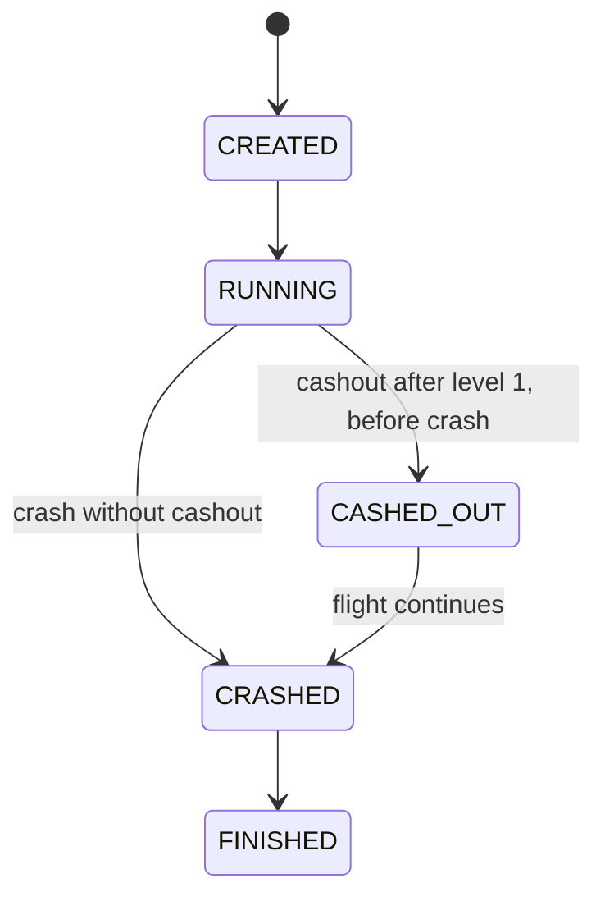

# Game Engine

## Аудит до реализации

Изучены весь `backend/`, README, CONTRIBUTING, архитектура, игровая механика,
API-контракт, командное распределение, MVP checklist и Docker Compose.
На исходном коммите `9db3b3c` backend содержал только README. Java-классов,
controller/service/domain/repository, DTO, WebSocket, GameRound, математической модели,
тестов, сборки и Swagger не было. Стек был заявлен как Java 21 + Spring Boot 3.
Конфигурация состояла из `.env.example` и Compose для PostgreSQL. API был `TBD`.
Повторно использованы структура монорепозитория, темы 9/12 уровней, правила cashout
и бустера, граница ответственности Backend/Data. Рабочий backend не переписывался.

## Запуск

Требуется JDK 21+ и доступ к Maven Central при первой сборке. Версия Spring Boot —
3.5.16, Maven Wrapper — 3.9.11, compile target — Java 21.
[Требования Spring Boot 3.5](https://docs.spring.io/spring-boot/3.5/system-requirements.html)
подтверждают поддержку этой версии Java. Wrapper проверяет SHA-256
дистрибутива Maven. PostgreSQL для движка в demo/dev не нужен.

PowerShell из корня репозитория:

```powershell
cd backend
.\mvnw.cmd -B verify
.\mvnw.cmd spring-boot:run '-Dspring-boot.run.profiles=demo'
```

Linux/macOS:

```sh
cd backend
sh mvnw -B verify
sh mvnw spring-boot:run -Dspring-boot.run.profiles=demo
```

Вариант с JAR:

```powershell
java -jar backend/target/backend-0.1.0-SNAPSHOT.jar --spring.profiles.active=demo
```

Порт задаётся через `BACKEND_PORT` или `--server.port=8081`. Файлы `.env` Spring
самостоятельно не загружает: переменные нужно экспортировать в окружение процесса.

Для обычного server-generated seed запустить профиль `dev`. Без `test/dev/demo`
временные адаптеры и demo identity не включаются: нужны реальные Spring beans портов.

Проверка настоящего планировщика и WebSocket при запущенном demo-приложении:

```powershell
./scripts/game-engine-smoke.ps1 -BaseUrl http://localhost:8080
```

Скрипт подписывается до старта, ставит 100, ждёт бустера 2→6, делает cashout,
проверяет дальнейший рост, неизменность выплаты, однократность событий и финал.
Он использует реальное время и завершается примерно за 19 секунд.

## Архитектура

```text
REST / native JSON WebSocket / scheduled ticker
                   |
         application.GameService
         lock + ordered side effects
                   |
            domain.RoundEngine
    math + state machine + immutable snapshots
                   |
         application.port interfaces
       config / rounds / balance / rewards / events / seed
                   |
     dev memory adapters OR Backend #2 Spring beans
```

Domain и application не зависят от Spring, Jackson, WebSocket или PostgreSQL.
`RoundEngine` — чистые вычисления, `GameService` — оркестрация, деньги и порядок
интеграционных вызовов. `Clock` передаётся через конструктор. Snapshot `GameRound`
immutable и включает конфигурацию, с которой раунд был запущен. Его нельзя напрямую
отдавать клиенту: для этого есть отдельный allow-list `RoundView`.

## Lifecycle и state machine



`CREATED` — кратковременное доменное состояние; start сохраняет уже `RUNNING`.
`CRASHED` отражается в CRASH event, затем тем же переходом сохраняется `FINISHED`.
Невозможные переходы запрещены `RoundStateMachine`.

Cashout фиксирует выплату, коэффициент и timestamp, но не `finishedAt`. Уровни
после cashout продолжают отображаться. Принятое правило очков: после cashout
очки за новые уровни равны нулю, `roundScore` заморожен, новый бустер не включается.
Ранее включённый бустер продолжает влиять на визуальный коэффициент.
`FINISHED.outcome` — `CASHED_OUT` либо `LOSS`. Проигрыш сохраняет `winAmount=0.00`.

## Математика

### Рост

Для серверного времени `t` и времени старта `t0`:

```text
elapsedSeconds = max(0, floor((t - t0) / 1 millisecond)) / 1000
base(t) = 1 + growthPerSecond × elapsedSeconds
factor(t) = boosterMultiplier, если бустер уже активирован; иначе 1
authoritative(t) = floorTo4Decimals(base(t) × factor(t))
```

По умолчанию `growthPerSecond=0.10`. Деньги представлены `BigDecimal`:

```text
cashoutMultiplier = authoritative(commandHandledAt)
winAmount = floorTo2Decimals(betAmount × cashoutMultiplier)
```

Ставка допускает максимум 2 десятичных знака, коэффициент — 4. Округление выплаты
выполняется один раз через `RoundingMode.DOWN`. Денежные единицы — десятичные
единицы баланса, не копейки/центы. Адаптер с целочисленными minor units обязан
переводить через `movePointRight(2).longValueExact()` и обратно.

Engine посещает все математические границы между обработками, а не только значение
последнего тика. Timestamp границы — первый миллисекундный момент её достижения:

```text
crossingMillis = ceil(1000 × max(0, boundary - factor) / (growthPerSecond × factor))
```

После скачка бустера timestamp дополнительно ограничен снизу временем активации:
прыгнувшие уровни и crash не могут попасть в прошлое. При событии границы фиксируется
её коэффициент; на момент обработки команды рассчитывается коэффициент для всего
прошедшего времени. Время округляется до миллисекунд. Перевод часов назад не
уменьшает уже достигнутые время и коэффициент.

### Crash point

До публикации ROUND_STARTED сервер определяет:

```text
U = SplittableRandom(mixedSeed).nextDouble()  // [0, 1)
if U < alpha:
    X = minCrashMultiplier
else:
    X = (1 - alpha) / (1 - U)
X_final = min(X, maxCrashMultiplier)
crash = floorTo4Decimals(X_final)
```

`alpha` — house edge, `0 <= alpha < 1`. Вычисление ветки и деление выполняются
через `BigDecimal` с `DECIMAL128`; после технического max-clamp результат один раз
округляется вниз до scale 4. Граничное равенство `U == alpha` использует вторую
ветку. При `min=max` существующий deterministic demo/test range остаётся
фиксированным. Для обычного переменного диапазона product minimum равен x1;
validator не допускает `min > 1`, поскольку указанная piecewise-формула иначе
может вернуть значение ниже min.

Для `1 <= x <= maxCrashMultiplier` до влияния верхнего clamp:

```text
P(X >= x) = (1 - alpha) / x
```

При `minCrashMultiplier=1` вероятность немедленного crash на минимуме равна
`alpha` до влияния дискретной output precision. Seed остаётся серверным.

Crash и бустер используют независимые salted потоки `SplittableRandom`,
зависящие от seed, темы и выбранного множителя. Повторение этих входов и config
воспроизводит crash point и позицию бустера. Seed не раскрывается через API.

## Уровни и бустер

GREEN содержит ровно 9 порогов, RED — 12. Пороги строго возрастают и больше 1.
`currentLevel` — число уже пересечённых порогов. Каждый порог создаёт ровно одно
доменное событие `LEVEL_REACHED`, даже если один тик пересёк несколько уровней.

Для x1 `boosterLevel=null`, активации нет. Для x2/x3/x4 уровень выбирается до
старта по весам темы: `P(level i) = weight[i] / sum(weights)`.
Допускаются как вероятности с суммой 1, так и ненормализованные положительные
веса. Отрицательные значения, нулевой суммарный вес, неверная длина и null
отклоняются. Нулевой вес никогда не выбирается.

На первом достижении выбранного уровня до cashout:

```text
before = currentMultiplier
after = before × boosterMultiplier
boosterActivated = true
extraPoints = boosterPointsPerMultiplier × (boosterMultiplier - 1)
```

При defaults x3 даёт 300 дополнительных очков. За уровень начисляются отдельные
`ThemeConfig.points[level-1]`. Скачок 2→6 пересекает промежуточные пороги тем же
временем. Если скачок достигает crash, он завершает полёт сразу. Уровни строго
ниже crash засчитываются, порог, равный crash, — нет. Равенство crash и порога
бустера также выигрывает crash: активации не происходит.

## Гонки и интеграционные ошибки

У каждой сессии `roundId` собственный `ReentrantLock`. Под ним обрабатываются
tick, GET catch-up и cashout. Общего игрового lock нет. Одновременные тики не
дублируют переходы, два cashout дают один успех и один `ALREADY_CASHED_OUT`.

При cashout сначала завершаются ожидающие интеграционные операции, затем под
lock считывается `Clock.instant()`. Engine догоняет **все** границы до этого
времени. Поэтому cashout при уже наступившем crash отклоняется даже без тиков.
В точке бустера он сначала активируется, затем считается выплата.
Результат линеаризуется в момент чтения часов после захвата lock; время ожидания
HTTP в очереди до lock не даёт права на более ранний коэффициент.

Snapshot фиксируется один раз, затем выполняется очередь операций:
сохранить snapshot → credit при cashout → события; при финале вызвать reward hook
перед ROUND_FINISHED. Если адаптер выбрасывает исключение, невыполненная операция
остаётся первой в очереди. Следующий tick/GET/команда повторяет её с тем же ключом
и суммой. Повторно считать cashout нельзя. Ошибка одного раунда не прекращает
цикл обработки остальных. Причина интеграционного исключения сохраняется для логов.

Это in-memory очередь повторов, **не durable outbox**. Порты баланса, rewards,
событий и repository требуют идемпотентности: ответ мог потеряться уже после
успешного внешнего эффекта. Транспорт доставляет события at-least-once при повторе
publisher; потребитель дедуплицирует `(roundId, sequence)`. Сам domain-переход
генерирует событие уровня, бустера, cashout и crash только один раз.

## GameConfig и настройки запуска

Исходный config находится в `backend/src/main/resources/application.yml`.
Конфигурация проверяется при создании immutable объекта; невалидный config
нельзя установить в `InMemoryGameConfigProvider`. Binding неправильного YAML
останавливает запуск с причиной `INVALID_GAME_CONFIG`.

| Поле `game.config` | Правило / default |
| --- | --- |
| `min-crash-multiplier` | 1.00; >0, до 4 знаков; для переменного диапазона <=1 |
| `max-crash-multiplier` | 30.00; >=min, <=1,000,000 |
| `alpha` | 0.03; house edge, `0 <= alpha < 1` |
| `growth-per-second` | 0.10; [0.0001,10], до 4 знаков |
| `min-bet`, `max-bet` | 1.00 / 1000.00; >0, до 2 знаков; max<=1,000,000,000 |
| `booster-points-per-multiplier` | 150; целое [0,1,000,000,000] |
| `green.thresholds` / `red.thresholds` | 9 / 12 строго возрастающих порогов |
| `green.points` / `red.points` | 9 / 12 неотрицательных целых значений |
| `green.booster-weights` / `red.booster-weights` | 9 / 12 весов, суммарный вес >0 |

`game.tick-millis=100` задаёт около 10 фоновых обновлений/секунду; допустимы
50–1000 ms. `game.scheduler-enabled=false` отключает scheduler для управляемых
тестов. Критические события отправляются сразу. GET/cashout также могут создавать
catch-up события; frontend не должен опрашивать GET вместо подписки.
`CORS_ALLOWED_ORIGINS` ограничивает HTTP CORS и WebSocket Origin. Если список
не задан, backend строит его из `FRONTEND_SCHEME`, `FRONTEND_HOST` и
`FRONTEND_PORT`.

Изменение config через провайдер влияет только на новые раунды. Уже запущенный
раунд использует собственный snapshot, включая thresholds, points и growth.

## Fixed seed и trust model

`NORMAL` использует `SecureRandom.nextLong()` на сервере. `FIXED_SEED` использует
`game.fixed-seed`, заданный процессу при запуске. Он разрешён только если **все**
активные профили входят в `test/dev/demo`. `prod,dev`, отсутствие явного профиля
и отсутствие seed отклоняются. Профиль `demo` по умолчанию задаёт seed 42,
crash 8.42 и бустер на уровне 3 с порогом 2.00. Это позволяет воспроизвести
сценарий x3 → 6.00 → cashout → crash независимо от распределения обычного режима.

```powershell
.\mvnw.cmd spring-boot:run '-Dspring-boot.run.profiles=dev' `
  '-Dspring-boot.run.arguments=--game.random-mode=FIXED_SEED --game.fixed-seed=123'
```

Seed не принимается в JSON, query не используется как источник seed.
В `demo/dev/test` применяется один фиксированный UUID principal из `game.demo-user`
и стартовый баланс `game.demo-balance=1000.00`. Произвольный `X-User-Id` не даёт
права выбрать пользователя. Вне этих профилей authentication-слой Backend №2
должен предоставить проверенный `Principal.getName()` в формате UUID и для REST,
и для WebSocket handshake. Нет principal — 401. Нет права на round — 403.

Клиентские поля multiplier/win/seed/crash/boosterLevel/score/status/elapsedTime
отклоняются как неизвестные. Cashout требует пустое тело. WebSocket принимает
только подписку, команды через него закрывают соединение с кодом 1008.

## REST и realtime

Полный wire contract: [API_CONTRACT.md](API_CONTRACT.md).

| Метод | URL | Назначение |
| --- | --- | --- |
| POST | `/api/rounds` | Создать раунд и списать ставку |
| GET | `/api/rounds/{roundId}` | Авторитетный snapshot и восстановление после reconnect |
| POST | `/api/rounds/{roundId}/cashout` | Cashout без тела |
| WS | `/ws/rounds` | Все события только аутентифицированного пользователя |

Здесь native JSON WebSocket, без STOMP и `/topic/**`. Сервер отправляет
`CONNECTION_READY` после подписки. Откройте socket до POST start. После reconnect
сначала откройте socket, буферизуйте события, затем получите GET snapshot и
применяйте только события с `sequence > snapshot.sequence`. Для нескольких
активных раундов клиент хранит их id. Повторное подключение не воспроизводит
утраченные события; GET возвращает текущее состояние и cumulative score.

После start последовательность событий:
`ROUND_STARTED`, `MULTIPLIER_UPDATE`, `LEVEL_REACHED`, `BOOSTER_ACTIVATED`,
`CASHOUT_SUCCESS`, дальнейшие updates, `CRASH`, `ROUND_FINISHED`.
Без cashout события CASHOUT_SUCCESS нет. Новым пользователям не рассылаются чужие
раунды. Размер буфера socket ограничен 64 KiB, send limit — 1 s; неисправное
соединение отключается и не откатывает игровой результат.

## Контракты Backend №2

Все порты находятся в `ru.airballoon.game.application.port`:

| Порт | Что подключить |
| --- | --- |
| `GameConfigProvider.getCurrentConfig()` | Валидированный immutable `GameConfig` из storage/cache |
| `RoundRepository.save/findById` | Snapshot, включая seed/config/sequence; идемпотентный upsert с проверкой версии |
| `BalanceService.debitBet/creditWin` | Атомарные операции `BigDecimal` с ключами `(roundId,debit)` и `(roundId,credit)` |
| `RewardService.onRoundFinished` | Идемпотентный reward hook по roundId; selection/persistence принадлежат Backend №2 |
| `GameEventPublisher.publish` | По умолчанию Spring application event + приватный WebSocket |
| `SeedSource.nextSeed()` | Уже настроен сервером; клиент не управляет |

`@Bean` реальных balance/repository/config/reward реализаций достаточно для
подстановки через DI без изменения engine. В dev-адаптерах стоит
`@ConditionalOnMissingBean`. Замещение реального BalanceService проверено тестом.
Классы Backend №2 должны быть в component scan `ru.airballoon` либо импортированы
его конфигурацией. Domain/application не являются Spring components сами по себе.

Для начисления game_score Backend №2 может слушать `GameEvent` через `@EventListener`.
В LEVEL_REACHED и BOOSTER_ACTIVATED есть `roundId`, `level`, `pointsToAward`;
idempotency key события — `(roundId,sequence)`. Не начисляйте одновременно и
дельты событий, и полный `roundScore` snapshot: это два альтернативных способа
сохранения одного результата. Временный reward hook ничего не начисляет.

Start: config/validation → подготовка server seed → debit → создание snapshot
с фактическим временем после debit → сохранение → ROUND_STARTED. Seed создаётся
до debit, чтобы ошибка entropy source не списала ставку. Сам crash/booster
рассчитывается сервером при создании раунда. Если persistence после debit
временно недоступен, сессия уже есть в памяти и scheduler повторяет сохранение.
Start пока не идемпотентен между отдельными HTTP запросами: каждый POST — новая
ставка. Не делайте слепой автоматический retry start.

## Тесты и границы готовности

`./mvnw.cmd -B verify` запускает unit, concurrency, REST и настоящие WebSocket
integration tests, затем упаковывает executable JAR. Все сценарии используют
управляемый `Clock`, гонки — latch/future/barrier, без `Thread.sleep`.
Сетевые тесты имеют ограниченные timeout для обнаружения зависаний.

Проверяется полный 1000→900→1503 сценарий с x3, first-level gate, latest-time
cashout, повторные/одновременные команды, crash tie, мгновенный crash от бустера,
cadence independence, отсутствие повторов, 9/12 уровней, заморозка score,
config validation/snapshot, seed profiles, ownership, unknown fields, WebSocket
изоляция, сохранение выигрыша при отказах и замена DI-адаптера.

Ограничения этой реализации:

- Один authoritative JVM. Для нескольких инстансов нужны round ownership/routing
  и механизм fencing/сериализации; `ReentrantLock` не является распределённым lock.
- Очередь эффектов и активные сессии живут в памяти. При перезапуске незавершённые
  раунды требуют durable outbox/recovery от Backend №2. Просто PostgreSQL adapter
  не делает процесс crash-safe. Если найден незавершённый snapshot без recovery
  checkpoint, возвращается INTEGRATION_UNAVAILABLE вместо небезопасного cashout.
- Game Resilience удаляет завершённые сессии после успешных эффектов и вводит TTL
  для replay/checkpoints/snapshots. Fake balances остаются demo-адаптером Backend №2.
- Временные ошибки адаптера повторяются scheduler; для внешних систем нужны
  timeout/backoff и мониторинг. Game Resilience обрабатывает раунды в независимых
  scheduler-задачах, с максимум одной ожидающей/выполняющейся задачей на round.
- Есть bounded in-memory replay и recovery contracts; долговечных адаптеров нет.
- Production authentication, БД, награды, история и Admin API остаются Backend №2.
- Системная демо-математика не обещает регулируемый RTP. Добавлено упрощённое
  commit/reveal доказательство неизменности результата: [fairness.md](fairness.md).

Дополнения следующего этапа: [reconnect-recovery.md](reconnect-recovery.md).

Эти ограничения не препятствуют интеграции портов и frontend для одного
хакатонного процесса; они обозначают дополнительные задачи перед production.
